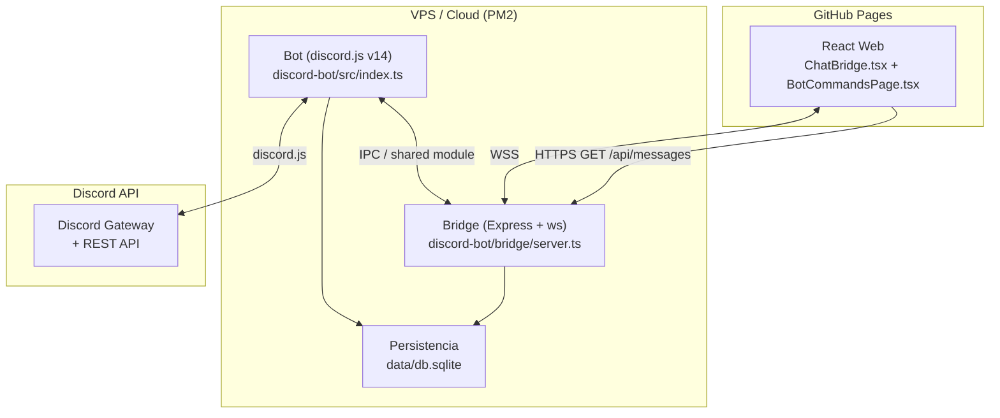

# Diseño Técnico: Discord Bot Integration

## Visión General

El sistema se compone de tres procesos independientes que colaboran entre sí:

1. **Bot** (`discord-bot/`) — proceso Node.js que se conecta a la API de Discord mediante discord.js v14. Gestiona comandos slash, eventos de guild, moderación, entretenimiento, economía, giveaways, niveles/XP y más.
2. **Bridge** (`discord-bot/bridge/`) — servidor Node.js/Express + WebSocket que actúa como intermediario entre el Bot y la Web. Expone una API REST y un servidor WebSocket para la sincronización bidireccional del ChatBridge.
3. **Web** (repo existente) — sitio React/TypeScript/Vite desplegado en GitHub Pages. Incorpora un componente `ChatBridge.tsx` que se conecta al Bridge vía WebSocket, y una página de comandos actualizada.

El Bot y el Bridge corren en el mismo servidor VPS/cloud bajo PM2. La Web es estática y se comunica con el Bridge a través de HTTPS/WSS.

---

## Arquitectura



### Flujo ChatBridge (Web → Discord)

```
Usuario Web → ChatBridge.tsx → WebSocket → Bridge → Bot.sendMessage() → Canal Discord
```

### Flujo ChatBridge (Discord → Web)

```
Canal Discord → Bot (messageCreate) → Bridge.broadcast() → WebSocket → ChatBridge.tsx
```

---

## Estructura de Carpetas

```
discord-bot/
├── src/
│   ├── index.ts
│   ├── client.ts
│   ├── config.ts
│   ├── modules/
│   │   ├── moderation/
│   │   │   ├── ban.ts
│   │   │   ├── kick.ts
│   │   │   ├── warn.ts              # /warn add|list|remove, /modlogs
│   │   │   ├── timeout.ts           # /timeout, /slowmode, /lockdown
│   │   │   ├── wordFilter.ts
│   │   │   └── antiSpam.ts
│   │   ├── utilities/
│   │   │   ├── purge.ts
│   │   │   ├── poll.ts              # temporizador automático, votos múltiples
│   │   │   ├── tickets.ts           # categorías, botón Reclamar, transcripción
│   │   │   ├── autoReply.ts         # regex, imágenes/embeds, cooldown
│   │   │   ├── reminders.ts         # /remindme, repetición diaria/semanal
│   │   │   ├── userInfo.ts          # /userinfo, /serverinfo
│   │   │   ├── suggestions.ts       # /suggest, /report
│   │   │   └── advancedUtils.ts     # /translate, /weather, /urban, /qr, /shorten
│   │   ├── entertainment/
│   │   │   ├── music.ts             # filtros audio, /lyrics, /playlist, botones
│   │   │   ├── memes.ts
│   │   │   └── games.ts             # /blackjack, /tictactoe, /hangman, leaderboard
│   │   ├── economy/
│   │   │   └── economy.ts           # /shop, /work, /rob, /bet, /top, rachas
│   │   ├── admin/
│   │   │   ├── autoRole.ts          # múltiples autoroles, /temprole
│   │   │   ├── auditLog.ts          # eventos extendidos
│   │   │   ├── backup.ts            # backup automático, restauración selectiva
│   │   │   ├── events.ts            # repetición semanal/mensual, notif. a rol
│   │   │   ├── giveaways.ts         # /gstart, /gend, /glist
│   │   │   ├── levels.ts            # /level, /leaderboard, roles por nivel
│   │   │   ├── config.ts            # /config con subcomandos
│   │   │   ├── embedBuilder.ts      # /embed, /say
│   │   │   ├── integrations.ts      # Twitch/YouTube notificaciones, /reddit
│   │   │   ├── devTools.ts          # /eval, /ping, /invite
│   │   │   ├── logsConfig.ts
│   │   │   └── welcome.ts
│   │   └── chatbridge/
│   │       └── chatbridge.ts
│   ├── handlers/
│   │   ├── commandHandler.ts
│   │   └── eventHandler.ts
│   ├── utils/
│   │   ├── embeds.ts
│   │   ├── progressBar.ts
│   │   ├── personality.ts
│   │   ├── sanitize.ts
│   │   ├── logger.ts
│   │   ├── database.ts              # Abstracción SQLite (better-sqlite3)
│   │   ├── cooldown.ts              # Gestor de cooldowns por comando/usuario
│   │   └── pagination.ts            # Paginación con botones ◀️ ▶️
│   └── types/
│       └── index.ts
├── bridge/
│   ├── server.ts
│   ├── rateLimiter.ts
│   └── messageStore.ts
├── data/
│   └── db.sqlite                    # Base de datos principal (SQLite)
├── logs/
├── .env.example
├── package.json
├── tsconfig.json
└── ecosystem.config.js
```

---

## Componentes e Interfaces

### Bot — CommandHandler

Carga todos los archivos de comandos desde `modules/`, los registra en Discord vía REST al iniciar, y despacha la interacción correcta en el evento `interactionCreate`.

```typescript
interface SlashCommand {
  data: SlashCommandBuilder;
  execute(interaction: ChatInputCommandInteraction): Promise<void>;
}
```

### Bot — EventHandler

Eventos relevantes:
- `guildMemberAdd` → autoRole, embed de bienvenida con GIF, XP inicial
- `guildMemberRemove` → AuditLog (salida de miembro)
- `messageCreate` → wordFilter, antiSpam, autoReply, chatbridge, XP
- `messageUpdate` → AuditLog (edición de mensaje)
- `messageDelete` → AuditLog (eliminación de mensaje)
- `guildMemberUpdate` → AuditLog (cambio de roles)
- `channelCreate` / `channelDelete` → AuditLog
- `interactionCreate` → commandHandler

### Módulo de Moderación

```typescript
interface Warn {
  id: string;           // UUID v4
  memberId: string;
  guildId: string;
  reason: string;
  moderatorId: string;
  timestamp: string;    // ISO 8601
  active: boolean;
}

interface ModLog {
  id: string;
  memberId: string;
  guildId: string;
  action: "ban" | "kick" | "warn" | "timeout" | "mute" | "unwarn";
  reason: string;
  moderatorId: string;
  timestamp: string;
  duration?: string;    // para timeout/mute
}
```

### Módulo de Economía

```typescript
interface EconomyEntry {
  memberId: string;
  guildId: string;
  balance: number;
  lastDaily: string | null;   // ISO 8601
  dailyStreak: number;        // racha de días consecutivos
  lastWork: string | null;    // ISO 8601
}

interface ShopItem {
  id: string;
  guildId: string;
  name: string;
  description: string;
  price: number;
  roleId?: string;            // rol que otorga al comprar
}
```

### Módulo de Giveaways

```typescript
interface Giveaway {
  id: string;
  guildId: string;
  channelId: string;
  messageId: string;
  prize: string;
  winnersCount: number;
  participants: string[];     // member IDs
  endsAt: string;             // ISO 8601
  ended: boolean;
  winners: string[];          // member IDs seleccionados
  creatorId: string;
}
```

### Módulo de Niveles y XP

```typescript
interface LevelEntry {
  memberId: string;
  guildId: string;
  xp: number;
  level: number;
  lastXpGrant: string | null; // ISO 8601 — cooldown anti-spam 60s
}

interface LevelReward {
  guildId: string;
  level: number;
  roleId: string;
}
```

### Módulo de Recordatorios

```typescript
interface Reminder {
  id: string;
  memberId: string;
  guildId: string;
  channelId: string;
  message: string;
  fireAt: string;             // ISO 8601
  repeat: "none" | "daily" | "weekly";
  active: boolean;
}
```

### Módulo de Sugerencias

```typescript
interface Suggestion {
  id: string;
  guildId: string;
  authorId: string;
  content: string;
  messageId: string;
  channelId: string;
  status: "pending" | "approved" | "denied";
  timestamp: string;
}
```

### Módulo de Roles Temporales

```typescript
interface TempRole {
  id: string;
  memberId: string;
  guildId: string;
  roleId: string;
  expiresAt: string;          // ISO 8601
  active: boolean;
}
```

### Configuración por Servidor

```typescript
interface ServerConfig {
  guildId: string;
  prefix: string;
  modRoleId: string | null;
  adminRoleId: string | null;
  muteRoleId: string | null;
  logsChannelId: string | null;
  autoRoleIds: string[];       // múltiples autoroles
  autoRoleEnabled: boolean;
  chatBridgeChannelId: string | null;
  chatBridgeReadOnly: boolean;
  announcementsChannelId: string | null;
  suggestionsChannelId: string | null;
  staffChannelId: string | null;
  personalityMode: "friki" | "formal";
  gifUrls: {
    welcome: string;
    ban: string;
    ticket: string;
    event: string;
  };
  antiSpamExemptChannels: string[];
  trustedBots: string[];
  twitchChannels: string[];    // streamers a monitorear
  youtubeChannels: string[];   // canales YT a monitorear
  levelRewards: LevelReward[];
  shopItems: ShopItem[];
  workCooldownMs: number;
  autoReplyConfigs: AutoReplyConfig[];
}

interface AutoReplyConfig {
  trigger: string;
  response: string;
  isRegex: boolean;
  cooldownMs: number;
  imageUrl?: string;
  embedConfig?: object;
}
```

### Bridge — server.ts

- `GET /api/messages?limit=50` — devuelve los últimos N mensajes del buffer en memoria.
- `POST /api/messages` — recibe mensaje desde la Web, valida, sanitiza, aplica rate limiting y lo publica en Discord vía el Bot.
- WebSocket server en el mismo puerto — hace broadcast a todos los clientes conectados cuando llega un mensaje nuevo de Discord.

```typescript
interface BridgeMessage {
  id: string;
  author: string;
  content: string;
  source: "discord" | "web";
  timestamp: string;  // ISO 8601
  avatarUrl?: string;
}
```

### Componente Web — ChatBridge.tsx

Componente React que:
1. Al montar, llama a `GET /api/messages` para cargar el historial inicial.
2. Abre una conexión WebSocket al Bridge.
3. Muestra mensajes diferenciando visualmente `source: "discord"` vs `source: "web"`.
4. Muestra indicador "desconectado" y reintenta cada 5 s si el WebSocket se cierra.
5. Permite enviar mensajes con validación de longitud máxima (2000 chars).

### Componente Web — BotCommandsPage.tsx

Página React que muestra todos los comandos del bot organizados por categoría:
- Moderación, Utilidades, Entretenimiento, Economía, Administración, Giveaways, Niveles, Utilidades Avanzadas, Herramientas Dev.
- Para cada comando: nombre, descripción, sintaxis y permisos requeridos.

---

## Modelos de Datos

### Base de Datos SQLite (`data/db.sqlite`)

La migración de JSON a SQLite mejora la consistencia, el rendimiento en consultas y la integridad referencial. Se usa `better-sqlite3` para operaciones síncronas.

```sql
-- Warns y ModLogs
CREATE TABLE warns (
  id TEXT PRIMARY KEY,
  member_id TEXT NOT NULL,
  guild_id TEXT NOT NULL,
  reason TEXT NOT NULL,
  moderator_id TEXT NOT NULL,
  timestamp TEXT NOT NULL,
  active INTEGER NOT NULL DEFAULT 1
);

CREATE TABLE mod_logs (
  id TEXT PRIMARY KEY,
  member_id TEXT NOT NULL,
  guild_id TEXT NOT NULL,
  action TEXT NOT NULL,
  reason TEXT,
  moderator_id TEXT NOT NULL,
  timestamp TEXT NOT NULL,
  duration TEXT
);

-- Economía
CREATE TABLE economy (
  member_id TEXT NOT NULL,
  guild_id TEXT NOT NULL,
  balance INTEGER NOT NULL DEFAULT 0,
  last_daily TEXT,
  daily_streak INTEGER NOT NULL DEFAULT 0,
  last_work TEXT,
  PRIMARY KEY (member_id, guild_id)
);

-- Giveaways
CREATE TABLE giveaways (
  id TEXT PRIMARY KEY,
  guild_id TEXT NOT NULL,
  channel_id TEXT NOT NULL,
  message_id TEXT NOT NULL,
  prize TEXT NOT NULL,
  winners_count INTEGER NOT NULL DEFAULT 1,
  ends_at TEXT NOT NULL,
  ended INTEGER NOT NULL DEFAULT 0,
  creator_id TEXT NOT NULL
);

CREATE TABLE giveaway_participants (
  giveaway_id TEXT NOT NULL,
  member_id TEXT NOT NULL,
  PRIMARY KEY (giveaway_id, member_id)
);

-- Niveles y XP
CREATE TABLE levels (
  member_id TEXT NOT NULL,
  guild_id TEXT NOT NULL,
  xp INTEGER NOT NULL DEFAULT 0,
  level INTEGER NOT NULL DEFAULT 0,
  last_xp_grant TEXT,
  PRIMARY KEY (member_id, guild_id)
);

-- Recordatorios
CREATE TABLE reminders (
  id TEXT PRIMARY KEY,
  member_id TEXT NOT NULL,
  guild_id TEXT NOT NULL,
  channel_id TEXT NOT NULL,
  message TEXT NOT NULL,
  fire_at TEXT NOT NULL,
  repeat TEXT NOT NULL DEFAULT 'none',
  active INTEGER NOT NULL DEFAULT 1
);

-- Sugerencias
CREATE TABLE suggestions (
  id TEXT PRIMARY KEY,
  guild_id TEXT NOT NULL,
  author_id TEXT NOT NULL,
  content TEXT NOT NULL,
  message_id TEXT NOT NULL,
  channel_id TEXT NOT NULL,
  status TEXT NOT NULL DEFAULT 'pending',
  timestamp TEXT NOT NULL
);

-- Roles temporales
CREATE TABLE temp_roles (
  id TEXT PRIMARY KEY,
  member_id TEXT NOT NULL,
  guild_id TEXT NOT NULL,
  role_id TEXT NOT NULL,
  expires_at TEXT NOT NULL,
  active INTEGER NOT NULL DEFAULT 1
);

-- Configuración por servidor
CREATE TABLE server_config (
  guild_id TEXT PRIMARY KEY,
  config_json TEXT NOT NULL  -- JSON serializado de ServerConfig
);

-- Filtro de palabras
CREATE TABLE word_filter (
  guild_id TEXT NOT NULL,
  word TEXT NOT NULL,
  PRIMARY KEY (guild_id, word)
);

-- AutoReplies
CREATE TABLE auto_replies (
  id TEXT PRIMARY KEY,
  guild_id TEXT NOT NULL,
  trigger TEXT NOT NULL,
  response TEXT NOT NULL,
  is_regex INTEGER NOT NULL DEFAULT 0,
  cooldown_ms INTEGER NOT NULL DEFAULT 0,
  image_url TEXT,
  embed_config TEXT
);

-- Trivia leaderboard
CREATE TABLE trivia_scores (
  member_id TEXT NOT NULL,
  guild_id TEXT NOT NULL,
  correct_answers INTEGER NOT NULL DEFAULT 0,
  PRIMARY KEY (member_id, guild_id)
);

-- Playlists de música
CREATE TABLE playlists (
  id TEXT PRIMARY KEY,
  member_id TEXT NOT NULL,
  guild_id TEXT NOT NULL,
  name TEXT NOT NULL
);

CREATE TABLE playlist_tracks (
  playlist_id TEXT NOT NULL,
  position INTEGER NOT NULL,
  url TEXT NOT NULL,
  title TEXT NOT NULL,
  duration INTEGER NOT NULL,
  PRIMARY KEY (playlist_id, position)
);
```

### Variables de Entorno (.env)

```env
# Bot
DISCORD_TOKEN=          # Token del bot (obligatorio)
CLIENT_ID=              # Application ID del bot
GUILD_ID=               # ID del servidor de Discord
OWNER_ID=               # ID del propietario (para /eval)

# Bridge
BRIDGE_PORT=3001
BRIDGE_SECRET=
BRIDGE_CORS_ORIGIN=

# APIs externas
YOUTUBE_API_KEY=        # Para búsquedas de música y notificaciones YT
TENOR_API_KEY=          # Para comando /gif
REDDIT_CLIENT_ID=
REDDIT_CLIENT_SECRET=
TWITCH_CLIENT_ID=       # Para notificaciones Twitch
TWITCH_CLIENT_SECRET=
WEATHER_API_KEY=        # OpenWeatherMap para /weather
TRANSLATE_API_KEY=      # LibreTranslate o DeepL para /translate
GENIUS_API_KEY=         # Para /lyrics (Genius API)
URL_SHORTENER_API_KEY=  # Para /shorten
```

---

## Nuevos Módulos — Descripción Detallada

### Moderación extendida (`timeout.ts`)

- `/timeout @user <duración> [razón]` — aplica timeout nativo de Discord. Duración en formato `1d`, `2h`, `30m`.
- `/slowmode <segundos>` — configura slowmode del canal actual (0 para desactivar).
- `/lockdown canal` — deniega `SEND_MESSAGES` a `@everyone` en el canal actual.
- `/lockdown servidor` — itera todos los canales de texto y aplica lockdown.
- `/lockdown unlock` — restaura permisos previos al lockdown.

### Sistema de Warns extendido (`warn.ts`)

- Niveles: 1 warn → DM de advertencia; 3 warns → mute 1h automático; 5 warns → kick automático.
- `/modlogs <member>` — historial completo con opción de exportar a JSON o CSV.
- Acciones automáticas configurables por servidor via `/config`.

### Encuestas con temporizador (`poll.ts`)

- `/poll <pregunta> <opciones> --tiempo <duración>` — cierre automático con `node-cron` o `setTimeout`.
- Votos múltiples opcionales configurables por encuesta.

### Tickets con categorías y transcripción (`tickets.ts`)

- Menú de selección de categoría (soporte, reportes, sugerencias) antes de crear el canal.
- Botón "Reclamar" que asigna el ticket a un moderador específico.
- `/ticket close` genera transcripción y la envía al canal de staff configurado.

### AutoReply con regex y cooldown (`autoReply.ts`)

- Soporte de expresiones regulares en triggers.
- Cooldown por usuario configurable para evitar spam de respuestas.
- Respuestas con imagen o embed configurado.

### Recordatorios (`reminders.ts`)

- `/remindme <tiempo> <mensaje>` — programa recordatorio con `node-cron`.
- Repetición `daily` o `weekly` — el recordatorio se reactiva automáticamente.
- Persistencia en SQLite; el scheduler se recarga al reiniciar el bot.

### Información de usuarios y servidor (`userInfo.ts`)

- `/userinfo [@member]` — fecha de ingreso, creación de cuenta, roles, warns activos, nivel XP.
- `/serverinfo` — nombre, ID, fecha de creación, miembros, canales, roles, propietario.

### Música extendida (`music.ts`)

- `/filter <bassboost|nightcore>` — aplica filtros de audio via FFmpeg args en `@discordjs/voice`.
- `/lyrics` — busca letra de la canción actual via Genius API.
- `/playlist create <nombre>` / `/playlist load <nombre>` — playlists persistidas en SQLite.
- Botones interactivos de control (pausa, skip, parar) en el embed del reproductor.

### Juegos extendidos (`games.ts`)

- `/blackjack <apuesta>` — partida de blackjack con botones (pedir/plantarse). Apuesta en monedas virtuales.
- `/tictactoe @rival` — tres en raya con tablero de botones interactivos 3×3.
- `/hangman` — ahorcado con palabra aleatoria, embed actualizable con progreso.
- Tabla de clasificación de trivia persistida en SQLite.

### Economía extendida (`economy.ts`)

- `/shop` — tienda con roles e items configurados por moderadores.
- `/work` — trabajo aleatorio con cooldown configurable.
- `/rob @user` — intento de robo con probabilidad configurable.
- `/bet <cantidad>` — apuesta 50/50.
- `/top` / `/richest` — ranking global con barras de progreso ASCII.
- Rachas en `/daily` — bonus proporcional a días consecutivos.

### AutoRole y TempRole (`autoRole.ts`)

- Múltiples autoroles configurables (lista de IDs).
- `/temprole @user <rol> <duración>` — rol temporal con revocación automática via `node-cron`.

### AuditLog extendido (`auditLog.ts`)

Nuevos eventos registrados:
- `messageUpdate` — edición de mensajes (antes/después).
- `messageDelete` — eliminación de mensajes.
- `guildMemberUpdate` — cambios de roles de miembros.
- `guildMemberAdd` / `guildMemberRemove` — entrada y salida.
- `channelCreate` / `channelDelete` — creación y eliminación de canales.

### Backup extendido (`backup.ts`)

- Backup automático programado via `node-cron` con intervalo configurable.
- `/backup restore <archivo> --selectivo` — lista de canales/roles para selección.

### Eventos extendidos (`events.ts`)

- Repetición semanal/mensual — el evento se recrea automáticamente tras cada ocurrencia.
- Notificación a rol específico configurado en el evento.

### Giveaways (`giveaways.ts`)

- `/gstart <duración> <premio> [ganadores]` — embed con botón "Participar" y contador.
- `/gend <id>` — finaliza inmediatamente y selecciona ganadores.
- `/glist` — lista de giveaways activos con tiempo restante.
- Selección aleatoria de ganadores al expirar; notificación por mención.

### Niveles y XP (`levels.ts`)

- XP por mensaje con cooldown anti-spam de 60s.
- Fórmula de nivel: `level = floor(sqrt(xp / 100))` (configurable).
- `/level` — nivel actual, XP, barra de progreso ASCII.
- `/leaderboard` — top 10 con paginación.
- Roles de recompensa automáticos al alcanzar niveles configurados.

### Embed Builder y Say (`embedBuilder.ts`)

- `/embed` — formulario modal interactivo para configurar título, descripción, color, imagen y campos.
- `/say <mensaje> [--embed]` — publica como el bot, elimina el mensaje original.

### Utilidades Avanzadas (`advancedUtils.ts`)

- `/translate <texto> [idioma]` — LibreTranslate o DeepL API.
- `/weather <ciudad>` — OpenWeatherMap API.
- `/urban <término>` — Urban Dictionary API.
- `/qr <texto>` — genera QR con librería `qrcode`.
- `/shorten <url>` — acortador de URLs (TinyURL API o similar).

### Sugerencias y Reportes (`suggestions.ts`)

- `/suggest <texto>` — publica en canal de sugerencias con reacciones 👍/👎.
- `/suggest approve|deny <id>` — actualiza estado y notifica al autor.
- `/report <usuario> <razón>` — reporte anónimo al canal de staff (sin revelar identidad).

### Integraciones Externas (`integrations.ts`)

- Polling de Twitch API cada 5 min para detectar streams en vivo.
- Polling de YouTube RSS feed para detectar nuevos videos.
- `/reddit <subreddit>` — posts recientes con paginación.

### Herramientas Dev (`devTools.ts`)

- `/eval <código>` — solo para `OWNER_ID`; ejecuta en contexto restringido.
- `/ping` — latencia del bot y de la API de Discord.
- `/invite` — enlace de invitación con permisos configurados.

### Configuración por Servidor (`config.ts`)

- `/config prefix|modrole|adminrole|logchannel|mute_role` — subcomandos de configuración.
- Configuración almacenada en SQLite, independiente por guild.

---

## Sistema de Personalidad y Tono (Req 31)

El módulo `utils/personality.ts` centraliza todos los mensajes del bot. Expone una función `getMessage(type, params, mode)` donde `mode` es `"friki" | "formal"` leído de la configuración del servidor.

```typescript
type MessageType =
  | "ban" | "kick" | "warn" | "timeout" | "mute"
  | "daily" | "ticketOpen" | "ticketClose"
  | "eventCreate" | "eventCancel"
  | "levelUp" | "giveawayWin"
  | "work" | "rob" | "bet";

function getMessage(type: MessageType, params: Record<string, string>, mode: "friki" | "formal"): string
```

---

## Sistema de Efectos Visuales (Req 32)

### Colores contextuales (`utils/embeds.ts`)

```typescript
const EMBED_COLORS = {
  ban:           0xFF4444,
  kick:          0xFF4444,
  warn:          0xFFD700,
  success:       0x44FF88,
  info:          0x4488FF,
  entertainment: 0x9B59B6,
  economy:       0x9B59B6,
  level:         0xF39C12,
  giveaway:      0xE91E63,
};
```

### Barras de progreso ASCII (`utils/progressBar.ts`)

```typescript
// Genera: [████████████░░░░░░░░] 60%
function progressBar(value: number, max: number, length = 20): string
```

### Paginación (`utils/pagination.ts`)

```typescript
// Genera ActionRow con botones ◀️ ▶️ para listas largas
function buildPaginationRow(currentPage: number, totalPages: number): ActionRowBuilder<ButtonBuilder>
```

### Cooldowns (`utils/cooldown.ts`)

```typescript
// Gestor de cooldowns en memoria por (userId, commandName)
class CooldownManager {
  set(userId: string, command: string, durationMs: number): void
  check(userId: string, command: string): number  // ms restantes, 0 si libre
}
```

---

## Manejo de Errores

| Escenario | Estrategia |
|---|---|
| `DISCORD_TOKEN` no definido | `process.exit(1)` con mensaje descriptivo |
| Permisos insuficientes del bot | Embed de error `#FF4444`, no lanza excepción |
| API externa caída | try/catch, respuesta de error descriptiva |
| Canal de logs eliminado | Desactiva AuditLog, notifica al owner por DM |
| WebSocket desconectado (cliente) | Reintento cada 5s con indicador visual |
| Mensaje Web > 2000 chars | HTTP 400, mensaje de error inline en el componente |
| JSON de backup inválido | Validación de schema, respuesta de error |
| URL de GIF inaccesible | Omite imagen, continúa sin excepción |
| Rate limit excedido | HTTP 429 |
| Modo solo-lectura activo | HTTP 403 |
| Comando en cooldown | Respuesta efímera con tiempo restante |
| /eval por no-owner | Respuesta efímera de error de permisos |
| SQLite error | Log de error, respuesta de error al usuario |

---

## Correctness Properties

*A property is a characteristic or behavior that should hold true across all valid executions of a system — essentially, a formal statement about what the system should do. Properties serve as the bridge between human-readable specifications and machine-verifiable correctness guarantees.*

---

### Property 1: Jerarquía de permisos impide acciones sobre roles superiores

*Para cualquier* par (moderador, objetivo) donde el objetivo tiene un rol con posición mayor que el moderador, cualquier acción de moderación (ban, kick, warn, timeout) debe ser rechazada por el sistema.

**Validates: Requirements 1.5**

---

### Property 2: Auto-sanción progresiva por warns

*Para cualquier* miembro con N warns activos: si N = 3 el sistema debe haber aplicado un mute automático de 1 hora; si N = 5 el sistema debe haber expulsado automáticamente al miembro. Ambas acciones deben quedar registradas en el AuditLog.

**Validates: Requirements 1.3, 1.4, 2.3, 2.4**

---

### Property 3: Round-trip del filtro de palabras

*Para cualquier* palabra agregada a la lista de palabras prohibidas mediante `/filtro add`, la palabra debe aparecer en el resultado de `/filtro list`; y tras ejecutar `/filtro remove` sobre esa misma palabra, no debe aparecer en la lista.

**Validates: Requirements 3.2, 3.3, 3.4**

---

### Property 4: Filtro insensible a mayúsculas y sustituciones

*Para cualquier* palabra en la lista de palabras prohibidas, un mensaje que contenga esa palabra en cualquier combinación de mayúsculas/minúsculas o con sustituciones de caracteres especiales (e.g., "@" por "a") debe ser detectado y eliminado.

**Validates: Requirements 3.1, 3.5**

---

### Property 5: Anti-spam por velocidad elimina excedentes

*Para cualquier* miembro que envíe N ≥ 5 mensajes en el mismo canal dentro de un intervalo de 5 segundos, los mensajes que superen el umbral deben ser eliminados y el miembro debe recibir un timeout de 60 segundos.

**Validates: Requirements 4.1**

---

### Property 6: Anti-spam por duplicados elimina repeticiones

*Para cualquier* secuencia de mensajes donde el mismo contenido aparece 3 o más veces consecutivas de un mismo miembro, los mensajes duplicados (a partir del tercero) deben ser eliminados.

**Validates: Requirements 4.2**

---

### Property 7: AuditLog registra toda acción administrativa

*Para cualquier* acción de la lista (ban, kick, warn, unwarn, timeout, purge, apertura/cierre de ticket, cambio de configuración, edición/eliminación de mensajes, cambios de roles, entrada/salida de miembros, creación/eliminación de canales), debe existir una entrada en el AuditLog que contenga: tipo de acción, miembro afectado, moderador responsable y timestamp en formato ISO 8601.

**Validates: Requirements 1.1, 1.2, 4.3, 2.1, 16.1, 16.3**

---

### Property 8: Round-trip de warns

*Para cualquier* warn registrado mediante `/warn add`, debe aparecer en el resultado de `/warn list` con todos sus campos (razón, moderador, fecha); y tras ejecutar `/warn remove` con su ID, no debe aparecer en la lista de warns activos.

**Validates: Requirements 2.1, 2.5, 2.6**

---

### Property 9: Persistencia de datos sobrevive reinicios

*Para cualquier* conjunto de datos (warns, economy, giveaways, reminders, suggestions, temp roles, XP/levels, server config) serializado a SQLite y deserializado, el resultado debe ser estructuralmente equivalente al original.

**Validates: Requirements 2.8, 8.5, 9.3, 14.13, 19.5, 20.6, 23.4, 26.6**

---

### Property 10: Purge respeta rango válido

*Para cualquier* valor de cantidad fuera del rango [1, 100], el comando `/purge` debe ser rechazado con un mensaje de error. Para cualquier valor dentro del rango, el número de mensajes eliminados debe ser igual al solicitado (o al disponible si hay menos mensajes en el canal).

**Validates: Requirements 5.1, 5.2**

---

### Property 11: Purge por usuario filtra correctamente

*Para cualquier* canal y cualquier miembro especificado en `/purge user:<member>`, todos los mensajes eliminados deben pertenecer únicamente a ese miembro; ningún mensaje de otros miembros debe ser eliminado.

**Validates: Requirements 5.3**

---

### Property 12: Invariante de un voto por miembro en encuestas

*Para cualquier* encuesta activa y cualquier miembro, el número de votos activos de ese miembro en la encuesta no puede superar 1. Si el miembro añade una segunda reacción, la primera debe ser eliminada.

**Validates: Requirements 6.4**

---

### Property 13: Porcentajes de encuesta suman 100%

*Para cualquier* encuesta cerrada con al menos un voto, la suma de los porcentajes de todas las opciones debe ser igual a 100% (con tolerancia de redondeo de ±1%).

**Validates: Requirements 6.2**

---

### Property 14: Límite de un ticket abierto por miembro

*Para cualquier* miembro con un ticket ya abierto, cualquier intento de abrir un segundo ticket debe ser rechazado con un mensaje efímero que indique el canal del ticket existente.

**Validates: Requirements 7.3, 7.4**

---

### Property 15: Round-trip de autorespuestas con regex

*Para cualquier* par (trigger, respuesta) registrado mediante `/autorespuesta add`, un mensaje que contenga el trigger (en cualquier combinación de mayúsculas/minúsculas, o que cumpla el patrón regex si está configurado como tal) debe disparar la respuesta asociada; y tras `/autorespuesta remove`, el trigger no debe disparar ninguna respuesta.

**Validates: Requirements 8.1, 8.2, 8.3, 8.4, 8.6**

---

### Property 16: Cooldown de autorespuesta por usuario

*Para cualquier* usuario que active una autorespuesta con cooldown configurado, el mismo usuario no debe recibir otra respuesta del mismo trigger dentro del período de cooldown configurado.

**Validates: Requirements 8.7**

---

### Property 17: Cola de música mantiene orden FIFO

*Para cualquier* cola de reproducción, ejecutar `/skip` debe avanzar a la siguiente pista en el orden en que fue añadida; y `/stop` debe resultar en una cola vacía.

**Validates: Requirements 11.2, 11.3, 11.4**

---

### Property 18: Manejo graceful de APIs externas caídas

*Para cualquier* fallo simulado de red en las APIs externas (Reddit, Tenor, YouTube, Twitch, Weather, Translate, Genius, Urban Dictionary), el bot debe responder con un mensaje de error descriptivo sin lanzar una excepción no controlada ni terminar el proceso.

**Validates: Requirements 12.3, 22.6, 24.4**

---

### Property 19: Respuestas de /8ball pertenecen al conjunto válido

*Para cualquier* pregunta enviada a `/8ball`, la respuesta del bot debe pertenecer exactamente al conjunto de las 20 respuestas estándar del 8-Ball mágico.

**Validates: Requirements 13.3**

---

### Property 20: Ruleta tiene distribución aproximada 1/6

*Para cualquier* muestra de N ≥ 600 ejecuciones de `/ruleta`, la proporción de resultados "disparo" debe estar dentro del intervalo [0.10, 0.23] (distribución binomial con p=1/6, intervalo de confianza 99%).

**Validates: Requirements 13.2**

---

### Property 21: /daily otorga monto en rango [100, 200] con bonus de racha

*Para cualquier* miembro elegible (sin cobro en las últimas 24h), ejecutar `/daily` debe incrementar su saldo en un valor base dentro del rango [100, 200] inclusive, más un bonus proporcional a la racha de días consecutivos.

**Validates: Requirements 14.1, 14.3**

---

### Property 22: Conservación de saldo en juegos de apuesta

*Para cualquier* juego de apuesta (blackjack, bet, rob) con dos participantes, la suma total de monedas de ambos participantes debe ser idéntica antes y después del juego. Si el apostador no tiene saldo suficiente, la operación debe ser rechazada y ambos saldos deben permanecer inalterados.

**Validates: Requirements 13.6, 14.6, 14.7, 14.10, 14.11**

---

### Property 23: Persistencia de economía sobrevive reinicios

*Para cualquier* estado de economía serializado a SQLite y deserializado, el resultado debe ser estructuralmente equivalente al original (mismos saldos, mismas fechas de último cobro, mismas rachas).

**Validates: Requirements 14.13**

---

### Property 24: Backup contiene todos los campos requeridos

*Para cualquier* guild, el JSON generado por `/backup create` debe contener para cada canal: nombre, tipo (texto/voz/categoría), posición, permisos por rol y tema. El JSON debe ser deserializable y pasar la validación de schema del bot.

**Validates: Requirements 17.1, 17.3**

---

### Property 25: Restore no elimina canales/roles existentes

*Para cualquier* guild con canales/roles preexistentes, ejecutar `/backup restore` debe añadir los canales/roles del backup sin eliminar ninguno de los preexistentes.

**Validates: Requirements 17.2**

---

### Property 26: Backup inválido es rechazado

*Para cualquier* JSON que no cumpla el schema del backup (campos faltantes, tipos incorrectos, estructura inválida), la operación `/backup restore` debe ser rechazada con un mensaje de error descriptivo.

**Validates: Requirements 17.4**

---

### Property 27: Validación de fecha futura en eventos

*Para cualquier* fecha en el pasado o igual al momento actual, el comando `/evento create` debe ser rechazado. Para cualquier fecha futura válida, el evento debe ser creado correctamente.

**Validates: Requirements 18.4**

---

### Property 28: Formato de mensajes del Bridge incluye prefijo [Web]

*Para cualquier* mensaje enviado desde la Web con cualquier nombre de usuario, el mensaje publicado en Discord debe tener exactamente el formato `[Web] <nombre_usuario>: <contenido>`.

**Validates: Requirements 28.2**

---

### Property 29: Bridge rechaza mensajes que superan 2000 caracteres

*Para cualquier* mensaje cuya longitud supere 2000 caracteres, el Bridge debe responder con HTTP 400 y un mensaje de error; el mensaje no debe ser publicado en Discord.

**Validates: Requirements 28.5**

---

### Property 30: Sanitización XSS en mensajes del Bridge

*Para cualquier* mensaje recibido desde la Web que contenga payloads XSS (scripts, etiquetas HTML, atributos de evento), el Bridge debe sanitizarlo antes de retransmitirlo, de forma que el mensaje resultante no contenga código ejecutable.

**Validates: Requirements 30.1**

---

### Property 31: Rate limiting del Bridge por IP

*Para cualquier* dirección IP que envíe más de 10 mensajes en una ventana de 60 segundos, los mensajes que superen el límite deben ser rechazados con HTTP 429; los primeros 10 mensajes deben ser aceptados.

**Validates: Requirements 30.2**

---

### Property 32: Bot ignora mensajes de bots no confiables

*Para cualquier* mensaje cuyo autor sea un bot no incluido en la lista de bots de confianza, el bot debe ignorarlo completamente (no ejecutar comandos, no aplicar filtros, no registrar en AuditLog).

**Validates: Requirements 30.3**

---

### Property 33: Modo solo-lectura rechaza mensajes con HTTP 403

*Para cualquier* mensaje entrante desde la Web cuando el modo solo-lectura está activo, el Bridge debe responder con HTTP 403 y el mensaje no debe ser publicado en Discord.

**Validates: Requirements 30.4**

---

### Property 34: Mensajes de personalidad contienen información estructural completa

*Para cualquier* acción de moderación (ban, kick, warn) en modo friki, el mensaje generado debe contener: la razón formal de la sanción, el miembro afectado y el moderador responsable, además del envoltorio temático correspondiente.

**Validates: Requirements 31.2, 31.3, 31.4, 31.5**

---

### Property 35: Modo formal omite tono de personalidad

*Para cualquier* acción ejecutada cuando `personalityMode = "formal"`, el mensaje generado no debe contener referencias a videojuegos, anime o cultura otaku; debe ser un mensaje estrictamente formal con la información estructural completa.

**Validates: Requirements 31.8**

---

### Property 36: Colores de embed corresponden al tipo de acción

*Para cualquier* acción del bot, el color del embed generado debe corresponder exactamente al mapeo definido: `#FF4444` para ban/kick, `#FFD700` para warns, `#44FF88` para confirmaciones exitosas, `#4488FF` para mensajes informativos, `#9B59B6` para entretenimiento/economía.

**Validates: Requirements 32.1**

---

### Property 37: Barras de progreso ASCII tienen longitud exacta de 20 caracteres

*Para cualquier* valor (0 ≤ value ≤ max) y cualquier contexto (música, economía, backup, daily cooldown, nivel XP), la barra de progreso generada debe tener exactamente 20 caracteres de longitud y el número de caracteres "llenos" debe ser proporcional al porcentaje (value/max).

**Validates: Requirements 32.2, 32.3, 32.4, 32.12**

---

### Property 38: GIF inaccesible no lanza excepción

*Para cualquier* URL de GIF configurada que no sea accesible (timeout, 404, error de red), el embed debe ser enviado sin campo de imagen y sin lanzar una excepción no controlada.

**Validates: Requirements 32.10**

---

### Property 39: Cuenta regresiva de eventos es matemáticamente correcta

*Para cualquier* evento futuro, la cuenta regresiva en formato `Xh Ym` incluida en el embed de recordatorio debe ser igual a la diferencia entre la hora de inicio del evento y el momento de envío del recordatorio, con precisión de ±1 minuto.

**Validates: Requirements 32.11**

---

### Property 40: Duración restante en cola es calculada correctamente

*Para cualquier* cola de reproducción con N pistas, la duración restante estimada de la pista en posición i debe ser igual a la suma de las duraciones de las pistas en posiciones 0..i-1 más la duración restante de la pista actual.

**Validates: Requirements 32.13**

---

### Property 41: Modo formal omite GIFs pero mantiene colores y barras

*Para cualquier* acción ejecutada cuando `personalityMode = "formal"`, el embed no debe contener campos de imagen (GIFs) ni emojis animados, pero sí debe mantener el color contextual correcto y las barras de progreso ASCII donde corresponda.

**Validates: Requirements 32.14**

---

### Property 42: Giveaway selecciona exactamente N ganadores únicos

*Para cualquier* giveaway con `winnersCount = N` y M participantes únicos (M ≥ N), al finalizar el giveaway el sistema debe seleccionar exactamente N ganadores, todos ellos participantes válidos y sin repetición.

**Validates: Requirements 19.2, 19.3**

---

### Property 43: XP de nivel es monotónico

*Para cualquier* miembro, si su XP aumenta, su nivel debe permanecer igual o aumentar; nunca debe disminuir. La fórmula `level = floor(sqrt(xp / 100))` garantiza esta propiedad.

**Validates: Requirements 20.2, 20.3**

---

### Property 44: Playlist round-trip

*Para cualquier* lista de pistas añadidas a una playlist mediante `/playlist create` y cargadas con `/playlist load`, la cola resultante debe contener exactamente las mismas pistas en el mismo orden que fueron añadidas.

**Validates: Requirements 11.9, 11.10**

---

### Property 45: QR round-trip

*Para cualquier* texto de longitud válida, generar un código QR con `/qr` y decodificarlo debe producir el texto original sin modificaciones.

**Validates: Requirements 22.4**

---

### Property 46: Reporte anónimo no revela identidad del reportador

*Para cualquier* reporte enviado mediante `/report`, el embed publicado en el canal de staff no debe contener el ID ni el nombre de usuario del miembro que envió el reporte.

**Validates: Requirements 23.3**

---

### Property 47: Configuración de servidor es independiente por guild

*Para cualquier* par de guilds distintas, modificar la configuración de una guild (via `/config`) no debe afectar la configuración de la otra guild. Cada guild debe tener su propio estado de configuración aislado.

**Validates: Requirements 26.7**

---

### Property 48: Paginación cubre todos los items

*Para cualquier* lista de N items con tamaño de página P, el número total de páginas debe ser `ceil(N / P)`, y la concatenación de todos los items de todas las páginas debe ser igual a la lista original sin duplicados ni omisiones.

**Validates: Requirements 27.4**

---

### Property 49: Lockdown/unlock es un round-trip de permisos

*Para cualquier* canal con permisos de envío de mensajes activos, aplicar `/lockdown canal` seguido de `/lockdown unlock` debe restaurar exactamente los permisos originales del canal.

**Validates: Requirements 1.8, 1.10**

---

### Property 50: Modlogs export contiene todos los campos requeridos

*Para cualquier* miembro con historial de moderación, el archivo exportado por `/modlogs` (JSON o CSV) debe contener para cada entrada: tipo de acción, razón, moderador responsable y timestamp en formato ISO 8601.

**Validates: Requirements 2.7**

---

## Testing Strategy

### Enfoque dual

Se usan dos tipos de tests complementarios:

- **Tests unitarios**: verifican ejemplos específicos, casos de integración y condiciones de error concretas.
- **Tests de propiedades** (property-based): verifican propiedades universales sobre rangos amplios de entradas generadas aleatoriamente.

### Tests unitarios (ejemplos y casos de borde)

Cubren:
- Integración con la API de Discord (mocks de discord.js): join de canal de voz, creación de canal de ticket, asignación de AutoRole.
- Comportamiento de reconexión del bot con backoff exponencial (mock de red).
- Validación de env vars al arrancar (`DISCORD_TOKEN` ausente → exit 1).
- Endpoint `GET /api/messages` devuelve ≤ 50 mensajes en formato `BridgeMessage`.
- Indicador de desconexión en `ChatBridge.tsx` cuando el WebSocket se cierra.
- Creación de evento con fecha futura válida.
- Cancelación de evento notifica a todos los asistentes.
- `/eval` rechazado para usuarios que no son el owner.
- Menú de categoría presentado antes de crear canal de ticket.
- Backup automático programado se ejecuta en el intervalo configurado.
- Evento con repetición semanal se recrea tras cada ocurrencia.
- Filtro de audio aplicado correctamente en el reproductor de música.

### Tests de propiedades (fast-check)

Librería: **fast-check** (TypeScript). Mínimo **100 iteraciones** por propiedad.

Cada test se etiqueta con:
```typescript
// Feature: discord-bot-integration, Property N: <texto de la propiedad>
```

Cada propiedad del diseño (Properties 1–50) debe ser implementada por exactamente un test de propiedad. Los generadores de fast-check producirán:
- Miembros con roles aleatorios (para propiedades de jerarquía y moderación)
- Listas de palabras y mensajes aleatorios (para filtro de palabras)
- Secuencias de mensajes con timestamps (para anti-spam)
- Conjuntos de warns con fechas aleatorias (para sanciones progresivas)
- Valores numéricos en y fuera de rangos válidos (para purge, daily, transfer)
- Strings de longitud variable incluyendo payloads XSS (para sanitización y validación)
- Estados de cola de música con duraciones aleatorias (para cálculos de tiempo)
- Valores de progreso (0 ≤ value ≤ max) para barras ASCII
- Listas de participantes de giveaway con N ganadores
- Valores de XP para verificar monotonía de niveles
- Pares de guilds para verificar aislamiento de configuración
- Listas de items para verificar paginación

### Configuración de fast-check

```typescript
import fc from "fast-check";

fc.assert(
  fc.property(/* arbitraries */, (input) => {
    // Feature: discord-bot-integration, Property N: <texto>
    // ... assertion
  }),
  { numRuns: 100 }
);
```

### Nuevas dependencias necesarias

```json
{
  "dependencies": {
    "better-sqlite3": "^9.0.0",
    "node-cron": "^3.0.0",
    "qrcode": "^1.5.0",
    "genius-lyrics": "^4.4.0"
  },
  "devDependencies": {
    "@types/better-sqlite3": "^7.6.0",
    "@types/qrcode": "^1.5.0"
  }
}
```
