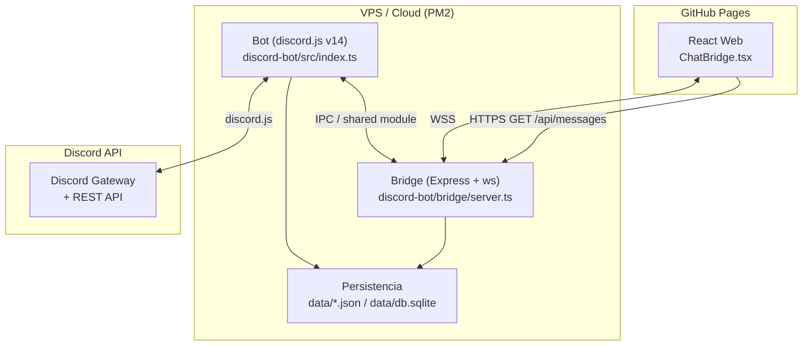

# Diseño Técnico: Discord Bot Integration

## Visión General

El sistema se compone de tres procesos independientes que colaboran entre sí:

1. **Bot** (`discord-bot/`) — proceso Node.js que se conecta a la API de Discord mediante discord.js v14. Gestiona comandos slash, eventos de guild, moderación, entretenimiento y economía.
2. **Bridge** (`discord-bot/bridge/`) — servidor Node.js/Express + WebSocket que actúa como intermediario entre el Bot y la Web. Expone una API REST y un servidor WebSocket para la sincronización bidireccional del ChatBridge.
3. **Web** (repo existente) — sitio React/TypeScript/Vite desplegado en GitHub Pages. Incorpora un componente `ChatBridge.tsx` que se conecta al Bridge vía WebSocket.

El Bot y el Bridge corren en el mismo servidor VPS/cloud bajo PM2. La Web es estática y se comunica con el Bridge a través de HTTPS/WSS.

---

## Arquitectura



### Flujo ChatBridge (Web → Discord)

```
Usuario Web → ChatBridge.tsx → WebSocket → Bridge → Bot.sendMessage() → Canal Discord
```

### Flujo ChatBridge (Discord → Web)

```
Canal Discord → Bot (messageCreate) → Bridge.broadcast() → WebSocket → ChatBridge.tsx
```

---

## Estructura de Carpetas

```
discord-bot/
├── src/
│   ├── index.ts                  # Entry point: carga env, registra comandos, inicia cliente
│   ├── client.ts                 # Instancia de Client con intents configurados
│   ├── config.ts                 # Lectura y validación de variables de entorno
│   ├── modules/
│   │   ├── moderation/
│   │   │   ├── ban.ts
│   │   │   ├── kick.ts
│   │   │   ├── warn.ts
│   │   │   ├── wordFilter.ts
│   │   │   └── antiSpam.ts
│   │   ├── utilities/
│   │   │   ├── purge.ts
│   │   │   ├── poll.ts
│   │   │   ├── tickets.ts
│   │   │   └── autoReply.ts
│   │   ├── entertainment/
│   │   │   ├── music.ts
│   │   │   ├── memes.ts
│   │   │   └── games.ts
│   │   ├── economy/
│   │   │   └── economy.ts
│   │   ├── admin/
│   │   │   ├── autoRole.ts
│   │   │   ├── auditLog.ts
│   │   │   ├── backup.ts
│   │   │   └── events.ts
│   │   └── chatbridge/
│   │       └── chatbridge.ts     # Escucha messageCreate y delega al Bridge
│   ├── handlers/
│   │   ├── commandHandler.ts     # Carga y despacha slash commands
│   │   └── eventHandler.ts       # Carga y registra event listeners
│   ├── utils/
│   │   ├── embeds.ts             # Helpers de embeds con colores contextuales
│   │   ├── progressBar.ts        # Generador de barras ASCII
│   │   ├── personality.ts        # Mensajes con tono friki / modo formal
│   │   ├── sanitize.ts           # Sanitización de texto
│   │   └── logger.ts             # Winston logger con rotación
│   └── types/
│       └── index.ts              # Tipos compartidos (Warn, EconomyEntry, etc.)
├── bridge/
│   ├── server.ts                 # Express + WebSocket server
│   ├── rateLimiter.ts            # Rate limiting por IP
│   └── messageStore.ts           # Buffer en memoria de últimos 50 mensajes
├── data/
│   ├── warns.json                # Warns persistidos
│   ├── economy.json              # Saldos de economía
│   ├── config.json               # Configuración de la guild (logs, autorole, etc.)
│   ├── wordFilter.json           # Lista de palabras prohibidas
│   └── autoReplies.json          # Triggers y respuestas automáticas
├── logs/                         # Archivos de log rotativos (Winston)
├── .env.example
├── package.json
├── tsconfig.json
└── ecosystem.config.js           # Configuración PM2
```

---

## Componentes e Interfaces

### Bot — CommandHandler

Carga todos los archivos de comandos desde `modules/`, los registra en Discord vía REST al iniciar, y despacha la interacción correcta en el evento `interactionCreate`.

```typescript
interface SlashCommand {
  data: SlashCommandBuilder;
  execute(interaction: ChatInputCommandInteraction): Promise<void>;
}
```

### Bot — EventHandler

Carga listeners desde `handlers/eventHandler.ts`. Eventos relevantes:
- `guildMemberAdd` → autoRole, embed de bienvenida con GIF
- `messageCreate` → wordFilter, antiSpam, autoReply, chatbridge
- `interactionCreate` → commandHandler

### Módulo de Moderación

Cada acción de moderación (ban, kick, warn) llama a `personality.ts` para obtener el mensaje formateado y a `embeds.ts` para construir el embed con el color correcto. Persiste warns en `data/warns.json`.

```typescript
interface Warn {
  id: string;           // UUID v4
  memberId: string;
  reason: string;
  moderatorId: string;
  timestamp: string;    // ISO 8601
  active: boolean;
}
```

### Módulo de Economía

```typescript
interface EconomyEntry {
  memberId: string;
  balance: number;
  lastDaily: string | null;  // ISO 8601
}
```

### Módulo ChatBridge

El módulo `chatbridge.ts` del Bot escucha `messageCreate` en el canal configurado y llama a `bridge.broadcast()` mediante una función exportada del Bridge (IPC en proceso o HTTP interno).

### Bridge — server.ts

- `GET /api/messages?limit=50` — devuelve los últimos N mensajes del buffer en memoria.
- `POST /api/messages` — recibe mensaje desde la Web, valida, sanitiza, aplica rate limiting y lo publica en Discord vía el Bot.
- WebSocket server en el mismo puerto — hace broadcast a todos los clientes conectados cuando llega un mensaje nuevo de Discord.

```typescript
interface BridgeMessage {
  id: string;
  author: string;
  content: string;
  source: "discord" | "web";
  timestamp: string;  // ISO 8601
  avatarUrl?: string;
}
```

### Componente Web — ChatBridge.tsx

Componente React que:
1. Al montar, llama a `GET /api/messages` para cargar el historial inicial.
2. Abre una conexión WebSocket al Bridge.
3. Muestra mensajes diferenciando visualmente `source: "discord"` vs `source: "web"`.
4. Muestra indicador "desconectado" y reintenta cada 5 s si el WebSocket se cierra.
5. Permite enviar mensajes con validación de longitud máxima (2000 chars).

Se integra en la web existente añadiendo una ruta `/discord` en `App.tsx` o como sección embebida en `Index.tsx`.

---

## Modelos de Datos

### config.json (configuración de guild)

```json
{
  "guildId": "string",
  "logsChannelId": "string | null",
  "autoRoleId": "string | null",
  "autoRoleEnabled": "boolean",
  "chatBridgeChannelId": "string | null",
  "chatBridgeReadOnly": "boolean",
  "announcementsChannelId": "string | null",
  "personalityMode": "friki | formal",
  "gifUrls": {
    "welcome": "string",
    "ban": "string",
    "ticket": "string",
    "event": "string"
  },
  "antiSpamExemptChannels": ["string"],
  "trustedBots": ["string"]
}
```

### warns.json

```json
{
  "memberId": [
    {
      "id": "uuid",
      "reason": "string",
      "moderatorId": "string",
      "timestamp": "ISO8601",
      "active": true
    }
  ]
}
```

### economy.json

```json
{
  "memberId": {
    "balance": 0,
    "lastDaily": "ISO8601 | null"
  }
}
```

### Variables de Entorno (.env)

```env
# Bot
DISCORD_TOKEN=          # Token del bot (obligatorio)
CLIENT_ID=              # Application ID del bot
GUILD_ID=               # ID del servidor de Discord

# Bridge
BRIDGE_PORT=3001        # Puerto del servidor Bridge
BRIDGE_SECRET=          # Secret compartido Bot↔Bridge para autenticación interna
BRIDGE_CORS_ORIGIN=     # Origen permitido (URL de GitHub Pages)

# APIs externas
YOUTUBE_API_KEY=        # Para búsquedas de música
TENOR_API_KEY=          # Para comando /gif
REDDIT_CLIENT_ID=       # Para comando /meme
REDDIT_CLIENT_SECRET=
```

---

## Sistema de Personalidad y Tono (Req 20)

El módulo `utils/personality.ts` centraliza todos los mensajes del bot. Expone una función `getMessage(type, params, mode)` donde `mode` es `"friki" | "formal"` leído de `config.json`.

```typescript
type MessageType = "ban" | "kick" | "warn" | "daily" | "ticketOpen" | ...;

function getMessage(type: MessageType, params: Record<string, string>, mode: "friki" | "formal"): string
```

Ejemplos de mensajes friki definidos como plantillas:
- **ban**: `"Game Over, {member}. Tu run en este servidor ha terminado. Razón: {reason}"`
- **kick**: `"Has sido desconectado del servidor, {member}. Respawn disponible si corriges tu comportamiento. Razón: {reason}"`
- **warn (n warns)**: `"Ojo, {member} — ya llevas {n} advertencias. Esto no es un tutorial, las consecuencias son reales."`

En modo `formal`, se usan plantillas neutras sin referencias culturales.

---

## Sistema de Efectos Visuales (Req 21)

### Colores contextuales (`utils/embeds.ts`)

```typescript
const EMBED_COLORS = {
  ban:     0xFF4444,
  kick:    0xFF4444,
  warn:    0xFFD700,
  success: 0x44FF88,
  info:    0x4488FF,
  entertainment: 0x9B59B6,
};
```

### Barras de progreso ASCII (`utils/progressBar.ts`)

```typescript
// Genera: [████████████░░░░░░░░] 60%
function progressBar(value: number, max: number, length = 20): string
```

Usada en: reproductor de música (`/play`, `/queue`), economía (`/daily` cooldown, ranking), backup por etapas.

### Typing indicator

Antes de operaciones costosas (búsqueda de música, trivia, backup), se llama a `interaction.channel.sendTyping()`.

### GIFs configurables

Las URLs de GIFs se leen de `config.json` (`gifUrls.*`). Si la URL no es accesible (fetch falla), el embed se envía sin imagen. En modo `formal`, los GIFs se omiten completamente.

---

## Manejo de Errores

- **Env vars faltantes**: `config.ts` valida al arrancar; si `DISCORD_TOKEN` no existe, `process.exit(1)` con mensaje descriptivo.
- **Permisos insuficientes**: cada comando verifica permisos antes de ejecutar; responde con embed de error `#FF4444`.
- **APIs externas caídas**: try/catch en todos los fetch externos; respuesta de error sin excepción no controlada.
- **Canal de logs eliminado**: el bot escucha `channelDelete`; si coincide con `logsChannelId`, lo pone a `null` en config y notifica al owner por DM.
- **WebSocket desconectado**: el cliente React reintenta con `setInterval` de 5 s; muestra badge "desconectado".
- **Mensaje Web > 2000 chars**: el Bridge responde HTTP 400 con mensaje de error; el componente lo muestra inline.
- **JSON de backup inválido**: validación con schema antes de restaurar; respuesta de error descriptiva.

---

## Estrategia de Testing

### Tests unitarios

- `utils/progressBar.ts` — ejemplos con valores límite (0, max, mitad)
- `utils/personality.ts` — ejemplos de cada tipo de mensaje en ambos modos
- `utils/sanitize.ts` — ejemplos con payloads XSS conocidos
- `modules/moderation/wordFilter.ts` — ejemplos con variaciones de caracteres especiales
- `modules/economy/economy.ts` — ejemplos de daily, transfer con saldo insuficiente
- `bridge/rateLimiter.ts` — ejemplos de ventana de rate limiting

### Tests de propiedades (property-based)

Se usará **fast-check** (TypeScript) con mínimo 100 iteraciones por propiedad.

Cada test se etiqueta con:
`// Feature: discord-bot-integration, Property N: <texto>`


---

## Correctness Properties

*A property is a characteristic or behavior that should hold true across all valid executions of a system — essentially, a formal statement about what the system should do. Properties serve as the bridge between human-readable specifications and machine-verifiable correctness guarantees.*

### Property 1: Jerarquía de permisos impide acciones sobre roles superiores

*Para cualquier* par (moderador, objetivo) donde el objetivo tiene un rol con posición mayor que el moderador, cualquier acción de moderación (ban, kick, warn) debe ser rechazada por el sistema.

**Validates: Requirements 1.5**

---

### Property 2: Auto-sanción progresiva por warns

*Para cualquier* miembro con N warns activos, si N ≥ 3 el sistema debe haber disparado un kick automático, y si N ≥ 5 warns en los últimos 30 días debe haber disparado un ban automático.

**Validates: Requirements 1.3, 1.4**

---

### Property 3: Round-trip del filtro de palabras

*Para cualquier* palabra agregada a la lista de palabras prohibidas mediante `/filtro add`, la palabra debe aparecer en el resultado de `/filtro list`; y tras ejecutar `/filtro remove` sobre esa misma palabra, no debe aparecer en la lista.

**Validates: Requirements 2.2, 2.3, 2.4**

---

### Property 4: Filtro insensible a mayúsculas y sustituciones

*Para cualquier* palabra en la lista de palabras prohibidas, un mensaje que contenga esa palabra en cualquier combinación de mayúsculas/minúsculas o con sustituciones de caracteres especiales (e.g., "@" por "a") debe ser detectado y eliminado.

**Validates: Requirements 2.1, 2.5**

---

### Property 5: Anti-spam por velocidad elimina excedentes

*Para cualquier* miembro que envíe N ≥ 5 mensajes en el mismo canal dentro de un intervalo de 5 segundos, los mensajes que superen el umbral deben ser eliminados y el miembro debe recibir un timeout de 60 segundos.

**Validates: Requirements 3.1**

---

### Property 6: Anti-spam por duplicados elimina repeticiones

*Para cualquier* secuencia de mensajes donde el mismo contenido aparece 3 o más veces consecutivas de un mismo miembro, los mensajes duplicados (a partir del tercero) deben ser eliminados.

**Validates: Requirements 3.2**

---

### Property 7: AuditLog registra toda acción administrativa

*Para cualquier* acción de la lista (ban, kick, warn, unwarn, purge, apertura/cierre de ticket, cambio de configuración), debe existir una entrada en el AuditLog que contenga: tipo de acción, miembro afectado, moderador responsable y timestamp en formato ISO 8601.

**Validates: Requirements 1.1, 1.2, 3.3, 4.1, 14.1, 14.3**

---

### Property 8: Round-trip de warns

*Para cualquier* warn registrado mediante `/warn`, debe aparecer en el resultado de `/warns` con todos sus campos (razón, moderador, fecha); y tras ejecutar `/unwarn` con su ID, no debe aparecer en la lista de warns activos.

**Validates: Requirements 4.1, 4.2, 4.3**

---

### Property 9: Persistencia de warns sobrevive reinicios

*Para cualquier* conjunto de warns serializado a JSON y deserializado, el resultado debe ser estructuralmente equivalente al original (mismo número de warns, mismos campos, mismos valores).

**Validates: Requirements 4.4**

---

### Property 10: Purge respeta rango válido

*Para cualquier* valor de cantidad fuera del rango [1, 100], el comando `/purge` debe ser rechazado con un mensaje de error. Para cualquier valor dentro del rango, el número de mensajes eliminados debe ser igual al solicitado (o al disponible si hay menos mensajes en el canal).

**Validates: Requirements 5.1, 5.2**

---

### Property 11: Purge por usuario filtra correctamente

*Para cualquier* canal y cualquier miembro especificado en `/purge user:<member>`, todos los mensajes eliminados deben pertenecer únicamente a ese miembro; ningún mensaje de otros miembros debe ser eliminado.

**Validates: Requirements 5.3**

---

### Property 12: Invariante de un voto por miembro en encuestas

*Para cualquier* encuesta activa y cualquier miembro, el número de votos activos de ese miembro en la encuesta no puede superar 1. Si el miembro añade una segunda reacción, la primera debe ser eliminada.

**Validates: Requirements 6.4**

---

### Property 13: Porcentajes de encuesta suman 100%

*Para cualquier* encuesta cerrada con al menos un voto, la suma de los porcentajes de todas las opciones debe ser igual a 100% (con tolerancia de redondeo de ±1%).

**Validates: Requirements 6.2**

---

### Property 14: Límite de un ticket abierto por miembro

*Para cualquier* miembro con un ticket ya abierto, cualquier intento de abrir un segundo ticket debe ser rechazado con un mensaje efímero que indique el canal del ticket existente.

**Validates: Requirements 7.3, 7.4**

---

### Property 15: Round-trip de autorespuestas

*Para cualquier* par (trigger, respuesta) registrado mediante `/autorespuesta add`, un mensaje que contenga el trigger (en cualquier combinación de mayúsculas/minúsculas) debe disparar la respuesta asociada; y tras `/autorespuesta remove`, el trigger no debe disparar ninguna respuesta.

**Validates: Requirements 8.1, 8.2, 8.3, 8.4**

---

### Property 16: Persistencia de autorespuestas sobrevive reinicios

*Para cualquier* conjunto de autorespuestas serializado a JSON y deserializado, el resultado debe ser estructuralmente equivalente al original.

**Validates: Requirements 8.5**

---

### Property 17: Cola de música mantiene orden FIFO

*Para cualquier* cola de reproducción, ejecutar `/skip` debe avanzar a la siguiente pista en el orden en que fue añadida; y `/stop` debe resultar en una cola vacía.

**Validates: Requirements 9.2, 9.3, 9.4**

---

### Property 18: Manejo graceful de APIs externas caídas

*Para cualquier* fallo simulado de red en las APIs externas (Reddit, Tenor, YouTube), el bot debe responder con un mensaje de error descriptivo sin lanzar una excepción no controlada ni terminar el proceso.

**Validates: Requirements 10.3**

---

### Property 19: Respuestas de /8ball pertenecen al conjunto válido

*Para cualquier* pregunta enviada a `/8ball`, la respuesta del bot debe pertenecer exactamente al conjunto de las 20 respuestas estándar del 8-Ball mágico.

**Validates: Requirements 11.3**

---

### Property 20: Ruleta tiene distribución aproximada 1/6

*Para cualquier* muestra de N ≥ 600 ejecuciones de `/ruleta`, la proporción de resultados "disparo" debe estar dentro del intervalo [0.10, 0.23] (distribución binomial con p=1/6, intervalo de confianza 99%).

**Validates: Requirements 11.2**

---

### Property 21: /daily otorga monto en rango [100, 200]

*Para cualquier* miembro elegible (sin cobro en las últimas 24h), ejecutar `/daily` debe incrementar su saldo en un valor dentro del rango [100, 200] inclusive.

**Validates: Requirements 12.1**

---

### Property 22: Conservación de saldo en transferencias

*Para cualquier* transferencia válida (emisor con saldo suficiente), la suma del saldo del emisor más el saldo del receptor debe ser idéntica antes y después de la transferencia. Si el emisor no tiene saldo suficiente, la transferencia debe ser rechazada y ambos saldos deben permanecer inalterados.

**Validates: Requirements 12.4, 12.5**

---

### Property 23: Persistencia de economía sobrevive reinicios

*Para cualquier* estado de economía serializado a JSON y deserializado, el resultado debe ser estructuralmente equivalente al original (mismos saldos, mismas fechas de último cobro).

**Validates: Requirements 12.6**

---

### Property 24: Backup contiene todos los campos requeridos

*Para cualquier* guild, el JSON generado por `/backup create` debe contener para cada canal: nombre, tipo (texto/voz/categoría), posición, permisos por rol y tema. El JSON debe ser deserializable y pasar la validación de schema del bot.

**Validates: Requirements 15.1, 15.3**

---

### Property 25: Restore no elimina canales/roles existentes

*Para cualquier* guild con canales/roles preexistentes, ejecutar `/backup restore` debe añadir los canales/roles del backup sin eliminar ninguno de los preexistentes.

**Validates: Requirements 15.2**

---

### Property 26: Backup inválido es rechazado

*Para cualquier* JSON que no cumpla el schema del backup (campos faltantes, tipos incorrectos, estructura inválida), la operación `/backup restore` debe ser rechazada con un mensaje de error descriptivo.

**Validates: Requirements 15.4**

---

### Property 27: Validación de fecha futura en eventos

*Para cualquier* fecha en el pasado o igual al momento actual, el comando `/evento create` debe ser rechazado. Para cualquier fecha futura válida, el evento debe ser creado correctamente.

**Validates: Requirements 16.4**

---

### Property 28: Formato de mensajes del Bridge incluye prefijo [Web]

*Para cualquier* mensaje enviado desde la Web con cualquier nombre de usuario, el mensaje publicado en Discord debe tener exactamente el formato `[Web] <nombre_usuario>: <contenido>`.

**Validates: Requirements 17.2**

---

### Property 29: Bridge rechaza mensajes que superan 2000 caracteres

*Para cualquier* mensaje cuya longitud supere 2000 caracteres, el Bridge debe responder con HTTP 400 y un mensaje de error; el mensaje no debe ser publicado en Discord.

**Validates: Requirements 17.5**

---

### Property 30: Sanitización XSS en mensajes del Bridge

*Para cualquier* mensaje recibido desde la Web que contenga payloads XSS (scripts, etiquetas HTML, atributos de evento), el Bridge debe sanitizarlo antes de retransmitirlo, de forma que el mensaje resultante no contenga código ejecutable.

**Validates: Requirements 19.1**

---

### Property 31: Rate limiting del Bridge por IP

*Para cualquier* dirección IP que envíe más de 10 mensajes en una ventana de 60 segundos, los mensajes que superen el límite deben ser rechazados con HTTP 429; los primeros 10 mensajes deben ser aceptados.

**Validates: Requirements 19.2**

---

### Property 32: Bot ignora mensajes de bots no confiables

*Para cualquier* mensaje cuyo autor sea un bot no incluido en la lista de bots de confianza, el bot debe ignorarlo completamente (no ejecutar comandos, no aplicar filtros, no registrar en AuditLog).

**Validates: Requirements 19.3**

---

### Property 33: Modo solo-lectura rechaza mensajes con HTTP 403

*Para cualquier* mensaje entrante desde la Web cuando el modo solo-lectura está activo, el Bridge debe responder con HTTP 403 y el mensaje no debe ser publicado en Discord.

**Validates: Requirements 19.4**

---

### Property 34: Mensajes de personalidad contienen información estructural completa

*Para cualquier* acción de moderación (ban, kick, warn) en modo friki, el mensaje generado debe contener: la razón formal de la sanción, el miembro afectado y el moderador responsable, además del envoltorio temático correspondiente (Game Over para ban, expulsión de partida para kick, referencia al número de warns para warn).

**Validates: Requirements 20.2, 20.3, 20.4, 20.5**

---

### Property 35: Modo formal omite tono de personalidad

*Para cualquier* acción ejecutada cuando `personalityMode = "formal"`, el mensaje generado no debe contener referencias a videojuegos, anime o cultura otaku; debe ser un mensaje estrictamente formal con la información estructural completa.

**Validates: Requirements 20.8**

---

### Property 36: Colores de embed corresponden al tipo de acción

*Para cualquier* acción del bot, el color del embed generado debe corresponder exactamente al mapeo definido: `#FF4444` para ban/kick, `#FFD700` para warns, `#44FF88` para confirmaciones exitosas, `#4488FF` para mensajes informativos, `#9B59B6` para entretenimiento/economía.

**Validates: Requirements 21.1**

---

### Property 37: Barras de progreso ASCII tienen longitud exacta de 20 caracteres

*Para cualquier* valor (0 ≤ value ≤ max) y cualquier contexto (música, economía, backup, daily cooldown), la barra de progreso generada debe tener exactamente 20 caracteres de longitud y el número de caracteres "llenos" debe ser proporcional al porcentaje (value/max).

**Validates: Requirements 21.2, 21.3, 21.4, 21.13**

---

### Property 38: GIF inaccesible no lanza excepción

*Para cualquier* URL de GIF configurada que no sea accesible (timeout, 404, error de red), el embed debe ser enviado sin campo de imagen y sin lanzar una excepción no controlada.

**Validates: Requirements 21.10**

---

### Property 39: Cuenta regresiva de eventos es matemáticamente correcta

*Para cualquier* evento futuro, la cuenta regresiva en formato `Xh Ym` incluida en el embed de recordatorio debe ser igual a la diferencia entre la hora de inicio del evento y el momento de envío del recordatorio, con precisión de ±1 minuto.

**Validates: Requirements 21.12**

---

### Property 40: Duración restante en cola es calculada correctamente

*Para cualquier* cola de reproducción con N pistas, la duración restante estimada de la pista en posición i debe ser igual a la suma de las duraciones de las pistas en posiciones 0..i-1 más la duración restante de la pista actual.

**Validates: Requirements 21.14**

---

### Property 41: Modo formal omite GIFs y emojis animados pero mantiene colores y barras

*Para cualquier* acción ejecutada cuando `personalityMode = "formal"`, el embed no debe contener campos de imagen (GIFs) ni emojis animados, pero sí debe mantener el color contextual correcto y las barras de progreso ASCII donde corresponda.

**Validates: Requirements 21.15**

---

## Error Handling

Ver sección "Manejo de Errores" arriba. Resumen de estrategias:

| Escenario | Estrategia |
|---|---|
| `DISCORD_TOKEN` no definido | `process.exit(1)` con mensaje descriptivo |
| Permisos insuficientes del bot | Embed de error `#FF4444`, no lanza excepción |
| API externa caída | try/catch, respuesta de error descriptiva |
| Canal de logs eliminado | Desactiva AuditLog, notifica al owner por DM |
| WebSocket desconectado (cliente) | Reintento cada 5s con indicador visual |
| Mensaje Web > 2000 chars | HTTP 400, mensaje de error inline en el componente |
| JSON de backup inválido | Validación de schema, HTTP 400 / respuesta de error |
| URL de GIF inaccesible | Omite imagen, continúa sin excepción |
| Rate limit excedido | HTTP 429 |
| Modo solo-lectura activo | HTTP 403 |

---

## Testing Strategy

### Enfoque dual

Se usan dos tipos de tests complementarios:

- **Tests unitarios**: verifican ejemplos específicos, casos de integración y condiciones de error concretas.
- **Tests de propiedades** (property-based): verifican propiedades universales sobre rangos amplios de entradas generadas aleatoriamente.

### Tests unitarios (ejemplos y casos de borde)

Cubren:
- Integración con la API de Discord (mocks de discord.js): join de canal de voz, creación de canal de ticket, asignación de AutoRole.
- Comportamiento de reconexión del bot con backoff exponencial (mock de red).
- Validación de env vars al arrancar (`DISCORD_TOKEN` ausente → exit 1).
- Endpoint `GET /api/messages` devuelve ≤ 50 mensajes en formato `BridgeMessage`.
- Indicador de desconexión en `ChatBridge.tsx` cuando el WebSocket se cierra.
- Creación de evento con fecha futura válida.
- Cancelación de evento notifica a todos los asistentes.

### Tests de propiedades (fast-check)

Librería: **fast-check** (TypeScript). Mínimo **100 iteraciones** por propiedad.

Cada test se etiqueta con:
```typescript
// Feature: discord-bot-integration, Property N: <texto de la propiedad>
```

Cada propiedad del diseño (Properties 1–41) debe ser implementada por exactamente un test de propiedad. Los generadores de fast-check producirán:
- Miembros con roles aleatorios (para propiedades de jerarquía y moderación)
- Listas de palabras y mensajes aleatorios (para filtro de palabras)
- Secuencias de mensajes con timestamps (para anti-spam)
- Conjuntos de warns con fechas aleatorias (para sanciones progresivas)
- Valores numéricos en y fuera de rangos válidos (para purge, daily, transfer)
- Strings de longitud variable incluyendo payloads XSS (para sanitización y validación)
- Estados de cola de música con duraciones aleatorias (para cálculos de tiempo)
- Valores de progreso (0 ≤ value ≤ max) para barras ASCII

### Configuración de fast-check

```typescript
import fc from "fast-check";

fc.assert(
  fc.property(/* arbitraries */, (input) => {
    // Feature: discord-bot-integration, Property N: <texto>
    // ... assertion
  }),
  { numRuns: 100 }
);
```
